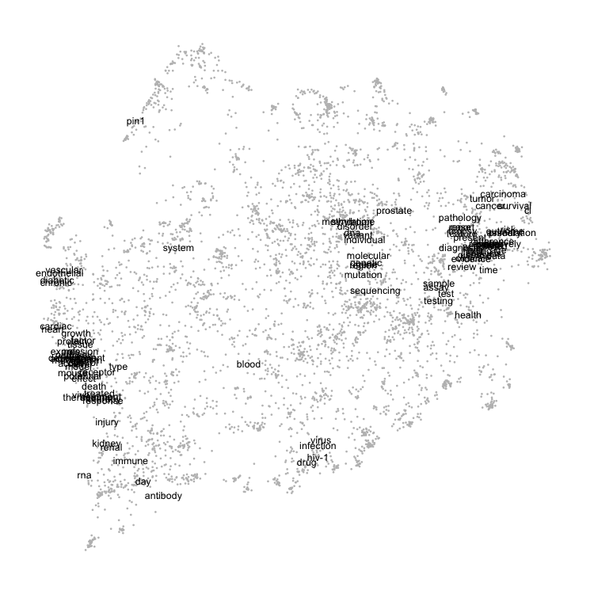
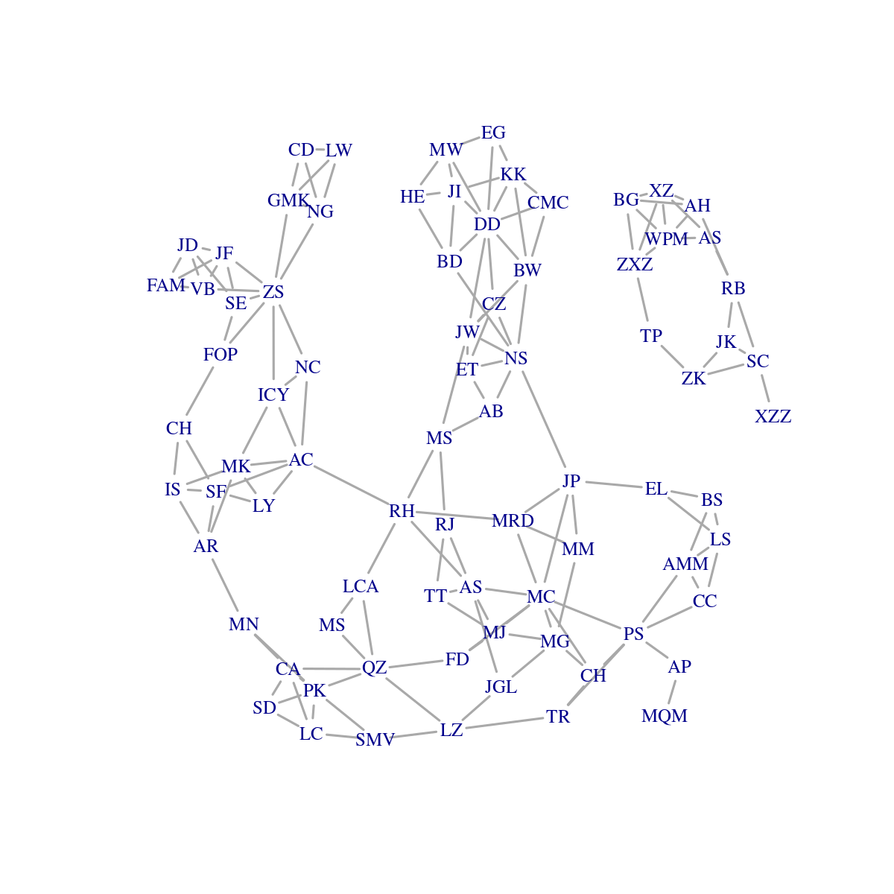
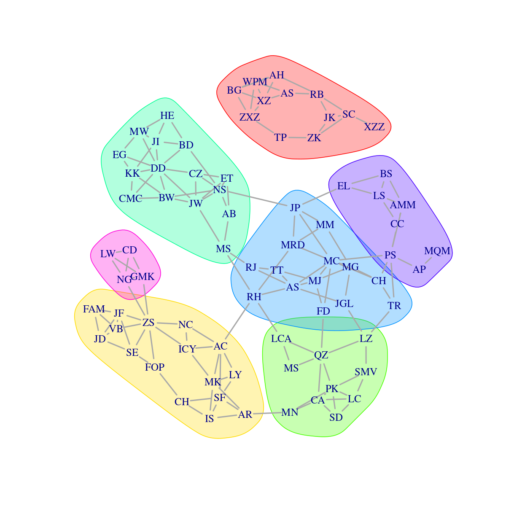

tragula
================

A pervasive obstacle to scientific collaboration is becoming aware of
your peers - those with shared research interests. Similarly, academic
units (*e.g.*, departments) are often tasked with identifing clusters of
expertise.

*tragula* is a set of Python and R scripts for analyzing and visualizing
the shared research topics among a set of authors based on their
published documents (scientific abstracts). In brief, the documents are
processed through standard text-mining techniques to extract informative
words. These words are then embedded into a “topic space”, such that
words that tend to occur in the same texts occupy similar locations in
this space. The frequency distribution of words for each author defines
a probability distribution over this embedding. Lastly, we measure the
distance between authors based on the amount of “work” required to
transform one author’s probability distribution into another’s.

## Installation

The Python and R scripts are provided as-is; there is no installation
required, just download and run. However, you will need to have the
following dependencies installed:

- [Python 3.x](https://www.python.org/) and the following modules:
  - [BioPython](https://biopython.org/), `pip install Bio`
  - [nltk](https://www.nltk.org/), `pip install nltk`.

  In addition, the following `nltk` submodules need to be installed to
  `~/nltk_data`:
  - [punkt](https://www.nltk.org/api/nltk.tokenize.punkt.html),
    `python -c "import nltk; nltk.download('punkt')"`
  - [averaged_perceptron_tagger](https://www.nltk.org/_modules/nltk/tag/perceptron.html),
    `python -c "import nltk; nltk.download('averaged_perceptron_tagger')"`
  - [wordnet](https://www.nltk.org/api/nltk.corpus.reader.wordnet.html),
    `python -c "import nltk; nltk.download('wordnet')"`
- [R](https://www.r-project.org/) version 4.3+ and the following
  packages:
  - [Matrix](https://cran.r-project.org/web/packages/Matrix/index.html)
  - [transport](https://cran.r-project.org/web/packages/transport/index.html)
  - [jsonlite](https://cran.r-project.org/web/packages/jsonlite/index.html)
  - [wordspace](https://cran.r-project.org/web/packages/wordspace/index.html)
  - [uwot](https://cran.r-project.org/web/packages/uwot/index.html)
  - [igraph](https://r.igraph.org/)

## Usage example

### Download text

We will use a Python script to retrieve publication records from the
NCBI PubMed database, do some initial text processing, and write the
results to JSON files (one per author) into a directory `data/palm`:

``` bash
% python scripts/batch_fetch.py --retmax 200 --email your.email@smtp.org data/palm.tsv data/palm
```

Of course you need to replace `your.email@smtp.org` with your own e-mail
address. This is required to query the NCBI database. In addition, I set
up this script to pause for one second between API queries to avoid
hitting the NCBI servers with too many requests. As a result, the script
will take about a minute to run to completion.

### Extract word counts

The next step is to process the documents that we’ve just downloaded
into three outputs: 1. a JSON file containing associative arrays of word
frequencies for each author; 2. a CSV file containing the term-document
co-occurrence matrix for every pair of words that appears at least once
in a given document, and; 3. a CSV file linking the integer indices used
in the co-occurrence matrix to the actual word, in descending order of
the word’s overall frequency in the entire corpus.

``` bash
% python scripts/analyze.py data/palm --counts results/palm_author.json --matrix results/palm_cooccur.csv --index results/palm_index.csv
```

### Import data

The `index` CSV file generated by `analyze.py` is a list of all words
encountered in the text corpus, in descending order by frequency. The
`wordcloud` package provides a nice way of visualizing the most frequent
words.

``` r
index <- read.csv("results/palm_index.csv")
require(wordcloud, quietly=TRUE)
set.seed(3)
wordcloud(index$word[1:50], index$count[1:50], 
          colors=hcl.colors(20, 'Berlin'), random.color=TRUE)
```


### Word embedding

The term-document co-occurrence matrix that we calculated in the
previous step tracks the number of times every word appears in each
document. This matrix becomes very large with even a modest number of
documents, so we store the results in a “sparse” format in which we only
record the number of times that word $i$ appears in document $j$,
skipping all cases in which this count is zero.

We assume that words tending to appear in the same documents fall under
a similar topic. For example, “phylogeny” and “sequence” tend to
co-occur in the same abstracts. The next step calculates the distance
between every pair of words based on their co-occurrence in documents.

To limit the amount of memory required to generate this distance matrix,
we limit our analysis to the 5,000 most frequent words. The frequency
distribution of words is very skewed, and words that have a very low
frequency are not very useful to comparing authors. To illustrate this
skewed distribution, let’s generate a quick barplot:

``` r
source("scripts/topicspace.R")
tab <- table(index$count)
par(mar=c(5,5,1,1))
plot(x=as.integer(names(tab)), y=as.integer(tab), las=2, 
     pch=19, cex=0.5,
     xlab="Number of times the word appears", ylab="Frequency")
```


For example, there are 4,415 times that a word appears only twice in the
entire set of documents (upper-left point). Note that words that
appeared only once were already filtered out during our processing
steps).

The `topicspace` function combines the three outputs generated by the
Python scripts, and uses a non-linear dimensionality reduction method
([UMAP](https://umap-learn.readthedocs.io/en/latest/)) to “embed” the
words into a smaller number of dimensions (controlled by the `n.comp`
argument). This function outputs a custom (`topicspace`) S3 class object
for which I’ve written a few generic methods (`print`, `summary` and
`plot`).

``` r
ts <- topicspace(
  index.path = "results/palm_index.csv",
  cooccur.path = "results/palm_cooccur.csv",
  author.path = "results/palm_author.json",
  max.words=5000, n.comp=3)
ts  # calls generic print function
```

    ## topicspace object
    ##    79 authors, 5000 words, 3 UMAP components
    ##    Top words: cell, patient, cancer, expression, clinical, disease 
    ##    Words per author: 1583.53 (range 231-4709)

Calling `plot` on a `topicspace` object displays the embedding of words
into the first two dimensions of the reduced space:

``` r
plot(ts)
```



By default the plot function only displays the 100 most frequent words,
replacing all other words with a small dot. Displaying all 5,000 words
on this plot would make it impossible to read! The same function can
also be used to resize points in proportion to a specific author’s word
frequency distribution, and compare it to the distributions of other
authors:

``` r
par(mfrow=c(1,2))  # side-by-side format
plot(ts, author=39)  # plot(ts, author="Poon_Art")
plot(ts, author=77)
```


### Earth mover’s distance

The final step of the analysis is to calculate a matrix of distances
between members of the department, based on the differences in their
respective word frequency distributions. Mapping a person’s word
frequencies onto the “topic space” into which we have embedded all the
words results in a weighted [point
pattern](https://en.wikipedia.org/wiki/Point_pattern_analysis) or
discrete probability distribution. Embedding words into topic space also
enables us to compare distributions between people who do not use
exactly the same words. For example, “carcinoma” is located close to
“tumor”.

To calculate the distance between two authors, we use the Wasserstein
distance, also known as the Kantorovich-Rubenstein or earth mover’s
distance. This distance roughly corresponds to the minimum amount of
work required to reshape one distribution into another, by transporting
probability mass between points. This is one of the most time-consuming
steps of the analysis, so I have set it up to run on 24 cores so that it
takes about one minute on my machine running an AMD Ryzen 9 7950X.
Hopefully your computer’s CPU has at least this many cores; if not, make
sure you to decrease the `mc.cores` argument in the following
expression. This particular dataset also requires about 1 GB of RAM per
core, so adjust for your system accordingly.

``` r
wdist <- get.dist(ts, mc.cores=24)
class(wdist)  # show that this is a custom S3 object
```

    ## [1] "wdist" "dist"

### Visualization

The last thing that we need to do is visually interpret the results of
this analysis. This is complicated by the fact that we’ve generated
another distance matrix. It is much smaller (79-by-79) than the
co-occurrence matrix that we started with (5000-by-79), but still
difficult to interpret.

Of course there are many methods to visualize a distance matrix. I’ve
provided some functions in a script called `visualize.R`. One of these
is simply a generic `plot` function calling a dimensionality reduction
method such as multi-dimensional scaling or UMAP:

``` r
source("scripts/visualize.R")

# map author names to initials
fac <- read.csv("data/palm.tsv", sep='\t')
fac$filename <- paste(fac$lastname, fac$forename, sep="_")
fac$filename <- gsub(" ", "_", fac$filename)
idx <- match(attr(wdist, "Labels"), fac$filename)
labels <- fac$initials[idx]

# use generic plot function for `wdist` object
par(mfrow=c(1,2))
plot(wdist, labels=labels, main='UMAP')
plot(wdist, labels=labels, type='m', main="MDS")
```


We can also use R’s built-in hierarchical clustering methods:

``` r
hc <- hclust(wdist)
plot(hc, cex=0.5, main=NA, xlab=NA, sub=NA, labels=labels)
```


My preferred method, however, is to generate a network (graph) in which
each node represents an author, and connections between authors indicate
that their similarity exceeds some threshold. Because some authors end
up forming a large number of connections (high degree size), I wrote a
function that only connects each author to their $k$ nearest neighbours,
where $k$ is set to 3 by default.

``` r
g <- make.knn(wdist)
plot(g, vertex.shape="none", vertex.label=labels, 
     vertex.label.cex=1, vertex.size=10, 
     edge.width=2, edge.arrow.mode='-')
```



We can use community detection to identify clusters in this graph, which
can be visualized by drawing coloured polygons:

``` r
cl <- cluster_louvain(g)
plot(g, mark.groups=cl, vertex.shape="none", vertex.label=labels, 
     vertex.label.cex=1, vertex.size=10, 
     edge.width=2, edge.arrow.mode='-')
```



Note that the clusters produced by the Louvain method are
non-overlapping; any overlap between polygons is due to constraints in
drawing polygons.
